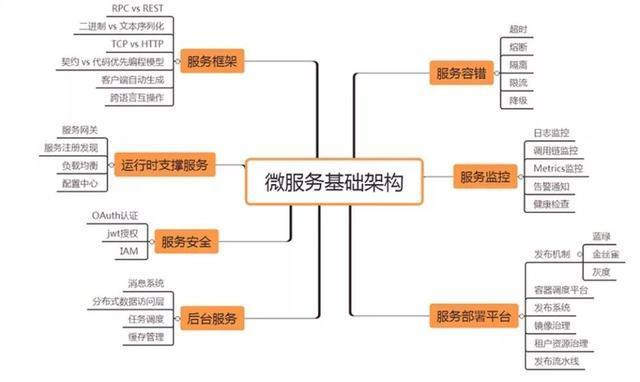
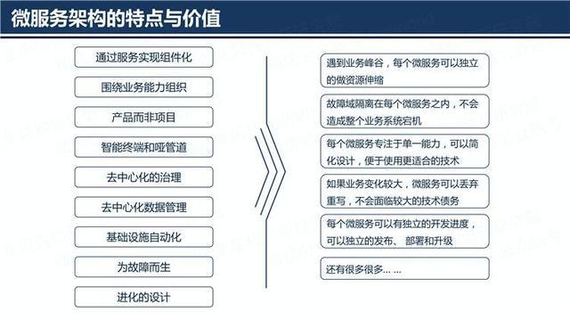
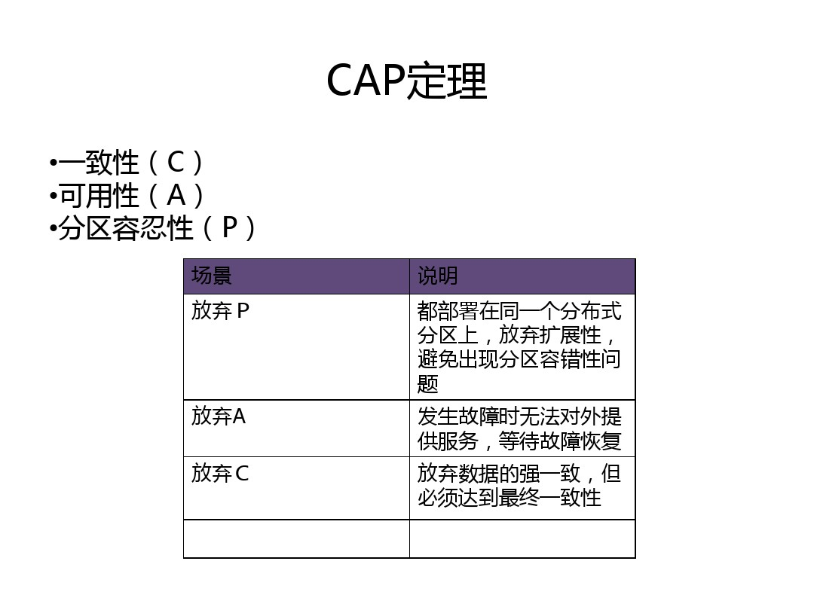

基础
-----------
- [cpu core](https://www.cnblogs.com/bugutian/p/6138880.html)
- [what is IO?](knowledge/io.md)
- [IO分类](knowledge/ioclass.md)
- [事务的隔离级别](knowledge/shiwu.md) [事务隔离和传播](https://www.cnblogs.com/WJ-163/p/6023054.html) [事务隔离举例](http://blog.csdn.net/gaoshan_820822/article/details/4582561)
- [JAVA基础](knowledge/java.md)

微服务架构
-------------

- [简介](http://microservices.io/)
- [定义](knowledge/definination.md)
- [微服务能解决的问题](knowledge/solve.md)
- 框架
    - dubbo [1](http://blog.csdn.net/xlgen157387/article/details/51865289) [2](http://blog.csdn.net/noaman_wgs/article/details/70214612) [3](http://blog.csdn.net/accp_fangjian/article/details/51658292) [4](http://blog.csdn.net/congcong68/article/details/41113239) [5](http://blog.csdn.net/accp_fangjian/article/details/51658292) [6](http://www.jianshu.com/p/f6db110d1185) [7](http://www.jikexueyuan.com/course/2781_3.html?ss=1)
    - [spring cloud](http://www.sohu.com/a/215668221_812245)
    - sprint boot

    
微服务周边
-------------
- oss
    - [阿里oss-phpsdk](https://m.aliyun.com/doc/document_detail/32099.html?spm=5176.product31815.3.57.tWoXX8)
    - [阿里oss例子](http://blog.csdn.net/liujiahan629629/article/details/45290311)
    - [openstack swift镜像](https://hub.docker.com/r/morrisjobke/docker-swift-onlyone/) [swift指令](knowledge/swift.md)
- gateway
    - [nginx](http://tengine.taobao.org/book/module_development.html)
    - [openresty](http://wiki.jikexueyuan.com/project/openresty/openresty/install.html)
    - [API网关Kong](https://github.com/Kong/kong) 
        - [1](https://baijiahao.baidu.com/s?id=1592523395197628336) [2](https://www.cnblogs.com/softidea/p/7261095.html)
        - [kong教程](http://www.cnblogs.com/SummerinShire/p/6386086.html) 
        - [dashboard](https://github.com/PGBI/kong-dashboard) 
        - [konga](https://github.com/pantsel/konga)
- config
    - Disconf
    - Archaius
    - QConf
    - Diamond
    - Spring Cloud Config
- schedule  
    - xxl-job
       - [xxl-job源码](https://github.com/xuxueli/xxl-job/) 
       - [xxl-job文档](http://www.xuxueli.com/xxl-job/)
    - Elastic-Job
- registydiscovery
    - [zookeeper]
    - Doozerd
    - Etcd
    - [Consul](https://www.jianshu.com/p/28c6bd590ca0)
    - Eureka
    
- [Oceanbase](https://www.zhihu.com/question/37421030) 
- [redis](https://www.cnblogs.com/mushroom/archive/2015/08/25/4752962.html) [命令](http://geek.csdn.net/news/detail/67399) [分布式锁](http://yunshen0909.iteye.com/blog/2291217) [教程](http://www.runoob.com/redis/scripting-evalsha.html)

扩展性
----------------
- 读写分离(Master/salve)

- 垂直分区(分库)

- 水平分区(分表，sharding)

- [Nosql](http://www.runoob.com/mongodb/nosql.html)

容错
------------

- Failover 失败自动切换

当出现失败，重试其它服务器，通常用于读操作（推荐使用）。 重试会带来更长延迟。

- Failfast  快速失败

只发起一次调用，失败立即报错,通常用于非幂等性的写操作。 如果有机器正在重启，可能会出现调用失败 。

- Failsafe 失败安全

出现异常时，直接忽略，通常用于写入审计日志等操作。 调用信息丢失 可用于生产环境 Monitor。

- Failback  失败自动恢复

后台记录失败请求，定时重发。通常用于消息通知操作 不可靠，重启丢失。 可用于生产环境 Registry。

- Forking  并行调用多个服务器

只要一个成功即返回，通常用于实时性要求较高的读操作。 需要浪费更多服务资源   。

- Broadcast

广播调用，所有提供逐个调用，任意一台报错则报错。通常用于更新提供方本地状态 速度慢，任意一台报错则报错 。

分布式共识(一致性）
--------------
- 类型
    - [Master-Slave 一般最终一致性](knowledge/masterslave.md)
    - [Master-Master 一般最终一致性](knowledge/mastermaster.md)
- 存储的一致性
   - [NWR模型](knowledge/nwr.md)
   - [一般最终一致性 CAP的选择权交给了用户，让用户自己的选择你的CAP中的哪两个](http://jimmee.iteye.com/blog/2234637)
   - [分布式Quorum机制,NWR策略读写模型 非强一致性，在P不能舍弃情况下，CA做妥协](http://m635674608.iteye.com/blog/2343038)
   - [HDFS用Quorum实现namenode HA](http://m.mamicode.com/info-detail-1416929.html)
- 服务系统的一致性
    - 1 解决分布式系统中如何就某个值（决议）达成一致
        - [2PC两阶段提交  Two  Phase Commit 强一致](knowledge/2pc.md)
        - [3PC三阶段提交  ThreePhase Commit 强一致](knowledge/3pc.md)
        - [paxos 强一致 进化的二段提交](http://www.jdon.com/artichect/paxos.html)
        - zab 强一致
        - raft 强一致
           - [动画演示](http://thesecretlivesofdata.com/raft/)
    - 2 解决分布式网络的应用层路由
        - DHT算法
    - 3 解决分布式环境下信息高效分发问题
        - gossip协议(最终一致性，集群成员关系管理，分布式P2P节点间元数据)
        - totem协议(强一致性) 
- [简介]（http://blog.csdn.net/followmyinclinations/article/details/52870418）
- [分布式一致性ppt](https://wk.baidu.com/view/396452c010a6f524cdbf8563.html#54)

分布式CAP
------------

- [悲观锁，乐观锁](knowledge/lock.md)
- [CAP,ACID,BASE](http://www.jdon.com/37625)
- CAP三原则理论（分布式系统理论，只能满足2个）
    - Consistency(一致性) 数据一致更新，所有数据变动都是同步的
    - Availability(可用性) 好的响应性能
    - Partition tolerance(分区容忍性) 可靠性
- ACID事务策略（ACID模型拥有 强一致性 + 可用性 很难进行分区 CA 关系数据库）
    - Atomicity原子性：一个事务中所有操作都必须全部完成，要么全部不完成。
    - Consistency一致性. 在事务开始或结束时，数据库应该在一致状态。
    - Isolation隔离层. 事务将假定只有它自己在操作数据库，彼此不知晓。
    - Durability. 一旦事务完成，就不能返回。
- BASE事务策略（反ACID模型，完全不同ACID模型，牺牲高一致性，获得可用性或可靠性 AP 分布式数据库）
    - Basically Available基本可用。支持分区失败(e.g. sharding碎片划分数据库)
    - Soft state软状态 状态可以有一段时间不同步，异步。
    - Eventually consistent最终一致，最终数据是一致的就可以了，而不是时时高一致。
- CP（CP 主要是一些Key-value数据库，典型代表为google的Big Table, redis）

- [AP和CP抉择]（knowledge/apcp.md)

- NOSQL(拓展了BASE思想，可按照具体情况定制CAP特别方案)
    - Key-Value存储，如Amaze Dynamo等，可根据CAP三原则灵活选择不同倾向的数据库产品。
    - 领域模型 + 分布式缓存 + 存储（Qi4j和NoSql运动），可根据CAP三原则结合项目定制灵活的分布式方案，难度高。
- [两地三中心](http://blog.csdn.net/love_taylor/article/details/73603672) 

安全
--------
*[csrf](http://netsecurity.51cto.com/art/201609/518323.htm)   *[csrf2](https://www.cnblogs.com/shytong/p/5308667.html)

*[xss](http://www.cnblogs.com/shytong/p/5308641.html)

